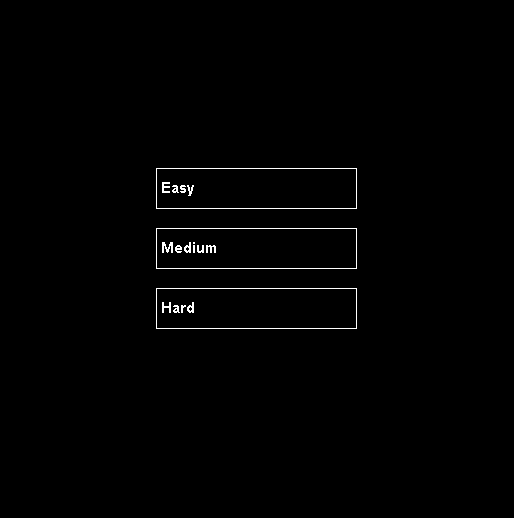
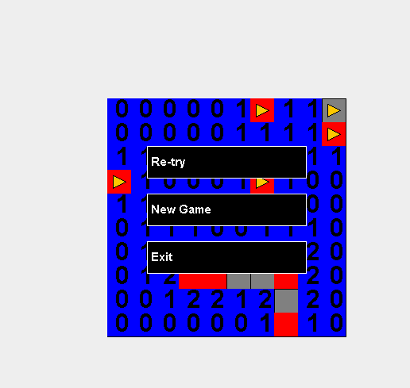

# GUI Mine Sweeper

## Snippets

---

## Requirements and Purpose

### MVP:

-   generate a game grid that is split into grid cells
-   randomly assign cells to contain a certain number of mines
-   A user can click a cell to reveal it
    -   if this cell is a mine then the game will reveal all location and be lost
    -   If this cell is not a mine then:
        -   if no adjacent cells have mines, this should reveal all adjacent cells and the chosen cell will display the number 0.
        -   if any adjacent cells have mines this cell will only reveal itself and will display a number between (1-8) that indicates the number of mines adjacent to the cell.
-   When every non-mine square is revealed the game is won
-   Implement a save functionality that saves to a text file:
    -   The result of the game (win or loss)
    -   The number of safe spaces unrevealed
    -   The size of the game board
    -   number of bombs in play
-   Allow players to flag bombs by right clicking a grid cell.
-   Allow for players to select an appropriate difficulty via a GUI Menu
-   Allow players upon win or loss to re-atempt at same difficutly, start a new game at a different difficutly, or exit the application. Utilising a GUI Menu.

### Purpose

The purpose of this project was to improve my skill as a Java program in an enjoyable way by building a simple game that could be exapanded signidicantly down the track. Additionally, this project aimmed to revise the OOP principles and Practices I had learnt in University and help apply these principles to a project outside of uni allowing me to hone and develop these within the project with each iteration.

### Stack

This project is a Java project utilising JFrame and JPanel for the graphical interface and JUnit for unit testing. This was chosen as the objective was to improve both my Java and my OOP. Building a game is a natural way to develop OOP skills due to the nature of games lending them to the practices of OOP.

## Design Goals

-   To produce a GUI mine sweeper game that provides a classic and intuitive minesweeper expereince. Utilising simple and familiar controls and a clear GUI.

-   Additionally the goal of building this application utilising OOP was to allow for a more modular application that was easily able to be expanded upon as well as tested efffectivley. Ontop of this, this project is actually the second of two. The first being a CLI mine sweeper game that implements much of the same logic and functionality. As such I made the CLI game with this GUI project in mind. This made OOP the ovbvious approach as it allowed me to adapt much of the inner functionality of the game with minimal changes, only adapting pieces for the graphical interface and changing some tests to work with this.

## Features

-   A GUI start and end screen:
    -   allows players to set difficulty, restart the game and exit the program all from the GUI
-   A GUI main gameplay loop:
    -   providing the classic feel and expereince of the original mine sweeper.
-   Auto Save to file:
    -   Allowing you to keep track of your best games!
-   Flag Mines:
    -   Just like the original! Flag mines to avoid being caught out
-   Cascading reveals:
    -   Like the original, click on a clear section of mines... and boom! A whole section of the map opens up
-   Randomly placed Mines:
    -   So no two games are alike!
-   Select your difficulty!:
    -   Easy 10x10 and 10 Mines
    -   Medium 16x16 and 40 Mines
    -   Hard 22x22 and 99 Mines

## Known Issues

-   menu/game state is quite tightly coupled. Making further development of these features more difficult until this is rectified

## Future Goals

-   Improve the design and logic behind the game and menu state handling to make it more understandable and less flimsy to future modifications
-   Improve the graphical desing of the game, currently quite bare bones, it would be ideal to get a fresh and more modern art style implemented into the game.

## Challenges Faced

-   Maintaining loose coupling between cell and grid objects was somewhat difficult especially in regard to maintaining performance on larger maps during a large cascade. Which due to the significant number of Cells having to be checked each click utilising a recursive function made this quite slow.
    -   This was overcome by ensuring that upon game load all the intensive checking of cells for bomb locations was already done, meaning that upon click a cell was already aware if it could cascade or not and as such this would allow the recursive function to avoid excessive nested loops of it's own, instead having this completed in the setup stage of the application also allowing for the cells to remain unaware of the grid object.

## Related projects

-   Console Mine Sweeper, check out it's repo to see the the intial CLI implementation of this game https://github.com/XelaRonnoc/consoleMineSweeper
